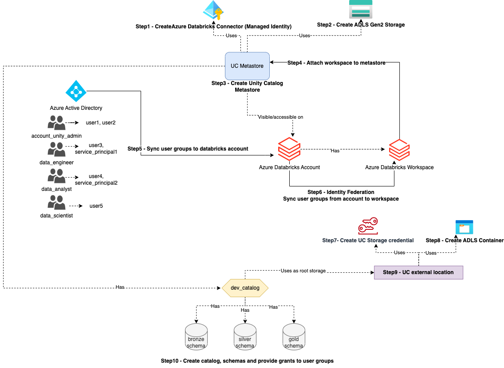

# Azure Databricks Unity Catalog

This repo contains terrafrom code to create a Databricks workspace, Databricks Unity Catalog, and setup databricks governance. Also C# code to retrieve the catolg table content using JDBC connection and REST API file to use Azure Databrucsk REST API to get the catalog table content.

## Architecture

## Prerequisites

- Azure Subscription
- Azure Databrick Resource with Premium Tier

## Terraform

1. Create Azure Databricks workspace - `Infra/adb-workspace` has a tarraform code to create a Databricks workspace.
2. Create Azure Databricks Unity Catalog - **Read the** [README](./Infra/README.md) for full instructions. `adb-unity-catalog` has a terraform code to create a Databricks Unity Catalog, sync users from AAD, create storage account and link the external location, create catalog and schemas and assign permissions to the groups.

## C# Code

`CSharp` folder contains a C# code to retrieve the catalog table content using JDBC connection. [here](Program.cs)

## REST API

Example usage of a Databricks REST API. [here](rest.rest)

## Resources

[Databricks REST API](https://docs.databricks.com/api/azure/workspace/introduction)

[Azure Databricks Unity Catalog E2E Terraform Samples](https://github.com/databricks/terraform-databricks-examples/tree/main/examples/adb-unity-catalog-basic-demo)

[ODBC Class .NET](https://learn.microsoft.com/en-us/dotnet/api/system.data.odbc.odbcconnection?view=net-8.0)